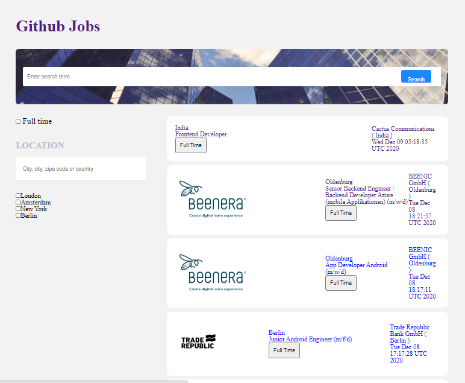
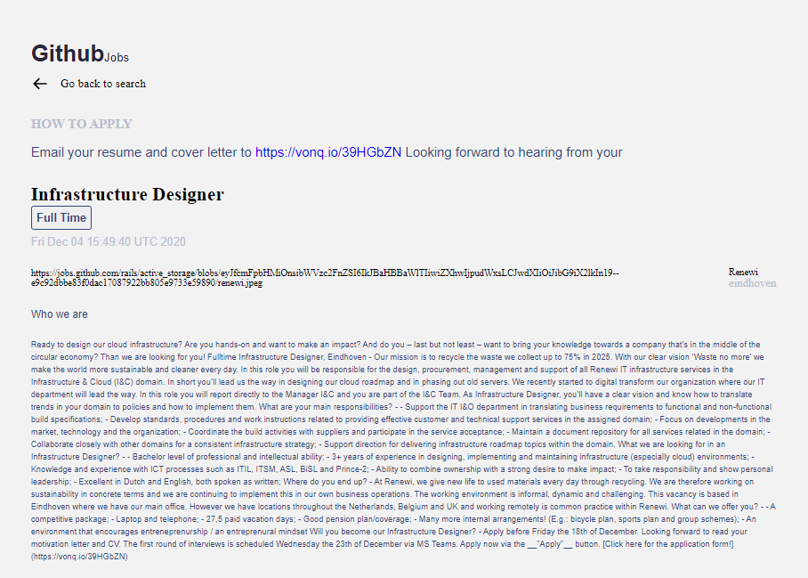
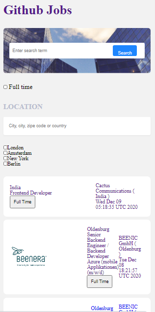

# Github Jobs

My goal with this projector is to create a job search using an API, and use React to handle the frontend. I fulfill what the  users will do in this app.
-   Netlify app [deploy](https://github-jobs-peta.netlify.app/)

<div align="center">
  <h3>
    <a href="https://{your-demo-link.your-domain}">
      Demo
    </a>
    <span> | </span>
    <a href="https://{your-url-to-the-solution}">
      Solution
    </a>
  </h3>
</div>

<!-- TABLE OF CONTENTS -->

## Table of Contents

-   [Overview](#overview)
    -   [Built With](#built-with)
-   [Features](#features)
-   [How to use](#how-to-use)
-   [Contact](#contact)
-   [Acknowledgements](#acknowledgements)

<!-- OVERVIEW -->

## Overview

1-  Screeshot for the desktop. It is not 
well-styled but I tried to make it 
nice-looking



2-  This is the description details of 
this github jobs when you click one of the 
github list jobs, the detail appears and 
you can go back to search another one  
again by clicking the back arrow. Both 
desktop and mobile have job details



3- This is the mobile screenshot app. The 
actions are similar to the desktop but 
only the feature which is not the same



## Description

The whole demo exists inside of the App.js and GlobalContext.js files.

#### **1- Folder descriptions**

  I have one big folder which handle all my folder whithin named components of this project. These are the folder inside it.

  -  I have a component folder which handles all the components where I handle the displaying of code. 
  -  I have a Main component folder to handle the functions of all displaying and the context function where I fetch the data from Api. 
 - I got a page folder just to handle the page's details component. 
 - I have a style component file just for the style and style css file too. I used both style from react and style from css.

### **2- Functions descriptions**

- I have GithubJobsApp files which handles the main of this code where the router and switch react set. 
- I used Router in this code to keep the link of the homepage and the details work properly.
- My GlobalContext file is the biggest file which keeps most of the functions and I created the context in there and access it by providing it in the return statement with a value object. There is also storing the apis data. These apis are worked by using useEffect and switch statement.

## Experience

In this project, I faced quite a lot of struggles to get most of the features.

- Getting the Api links worked because I got a cors bug but Thanks to google that I found a way how to solve it.
- Filtering the data by clicking the search button. It took me a day to work on it but I was happy when I found a little way to solve some of it.
- Checking the checkbox of all the locations. 

## What I have learned and improve

- I learned new things by creating githubJobs application and filter some jobs from another country, full time work and type of github work from an API key. It was amazing! 
- I also learn about having more Apis links and use them according to what they can handle with. Also using more than two useEffects. Before I didn’t know how to use more than two useEffect at once but I improved my skills by doing this project.

## Things needed to improve

- Having a progress bar where the display appears

- Using many apis at once and use them as many ways as they are.

- Filter something by checking the checkbox.

## Some comment

- The fetching Api is very slow so you really have to wait around two minutes before it is loaded for you. It does like that every action that you take for example, checking the full time and locations checkboxes. 

- Having good name variables and functions are keys to understand more about code. It should always relate to what your functions do and help you to code it and find easily what I should code now. Not only for you to understand but also the others.

## Some problem

I couldn’t manage to finish the project until the end.


### Built With

<!-- This section should list any major frameworks that you built your project using. Here are a few examples.-->

-   [React](https://reactjs.org/)

## Features

<!-- List the features of your application or follow the template. Don't share the figma file here :) -->

## How To Use

<!-- Example: -->

To clone and run this application, you'll need [Git](https://git-scm.com) and [Node.js](https://nodejs.org/en/download/) (which comes with [npm](http://npmjs.com)) installed on your computer. From your command line:

```bash
# Clone this repository
$ git clone https://github.com/your-user-name/your-project-name

# Install dependencies
$ npm install

# Run the app
$ npm start
```

## Contact

-   Website [my-website.com](https://github-jobs-peta.netlify.app/)
-   GitHub [@tiaraha-funny](https://github.com/Tiaraha-funny/github-jobs)
